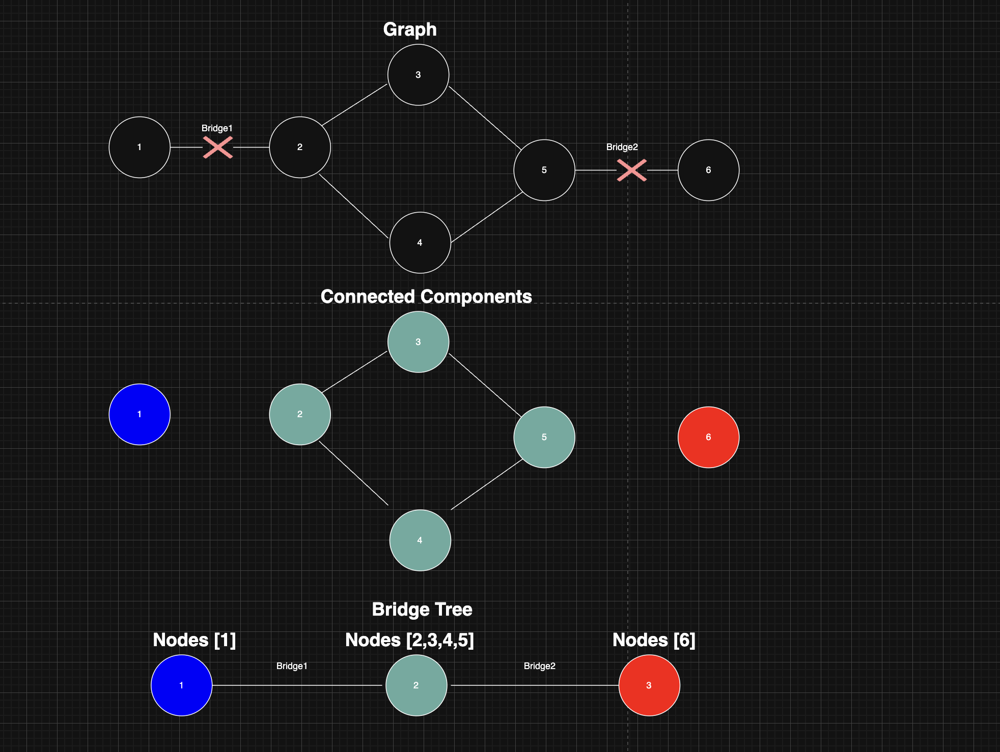
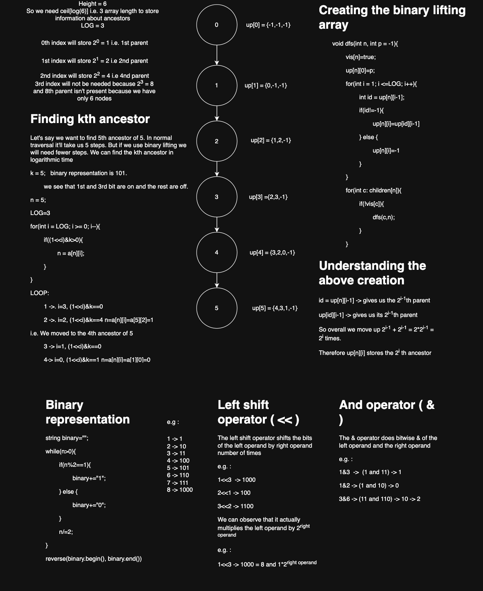

# Detailed Approach To Solve [Code Land](https://www.codechef.com/problems/PRCNSR2?tab=statement) on Codechef

## 1. Understanding the problem
#### 1. We are given an undirected weighted connected graph without multiple edges. 
#### 2. We need to remove exactly 1 edge so the graph doesn't stay connected.
#### 3. Then we need to add exactly 1 edge (possibly the same edge which we removed) to connect the graph again.
#### 4. We need to do these operations to achieve maximum gain in strength(Total sum of weight of all edges).

## 2. Understanding the given test case
#### INPUT:
1\
6 7 1000000\
1 2\
2 3\
3 1\
4 5\
5 6\
6 4\
3 4

OUTPUT:
24

#### Let's represent this with a diagram.


####
Strength/weight of edges\
Base Cases:
f(1, y) = 1 % MOD
f(x, 1) = 1 % MOD
f(1, 1) = 0

Function Definition:
if x != y : f(x, y) = ( f(x-1, y) + f(x, y-1) + f(x-1, y-1) ) % MOD
else : f(x, y) = 0

|| 1 | 2 | 3 | 4 | 5 | 6 |
|---|---|---|---|---|---|---|
| **1** | 0 | 1 | 1 | 1 | 1 | 1 |
| **2** | 1 | 0 | 2 | 4 | 6 | 8 |
| **3** | 1 | 2 | 0 | 6 | 16 | 30 |
| **4** | 1 | 4 | 6 | 0 | 22 | 68 |
| **5** | 1 | 6 | 16 | 22 | 0 | 90 | 
| **6** | 1 | 8 | 30 | 68 | 90 |0 |


#### After adding weights to the diagram


#### Graph representing the solution to the problem


#### We observe that only if the edge (3,4) is removed from the graph then the graph gets disconnected. There is no other edge which could be removed solely to disconnect the graph.

#### Now using the King's superpower we can possibly replace it with another edge so that the graph still stays connected.

#### After removing the edge (3,4) with weight 6, we have 2 connected components (1,2,3) and (4,5,6). Now we need to find an edge from one of the nodes in (1,2,3) to one of the nodes in (4,5,6) with the maximum weight. We find that the edge (6,3) is of maximum weight 30.

#### Therefore maximum gain in strength = 30-6 =24

## 3. Breaking down the problem.
#### 1. We need to find the weights of the graph.
#### 2. We need to find the list of edges of the graph such that if exactly 1 edge from that list is removed from the graph then the graph gets disconnected.
#### 3. We need to find an edge from that list and remove it which would disconnect the graph and then find its maximum strength replacement edge which would connect the graph and maximize the gain in strength.

## 4. Calculation of strength(weight) of roads
#### Given:
```
f(1,y)=1%MOD
f(x,1)=1%MOD
f(1,1)=0
if x != y : f(x, y) = ( f(x-1, y) + f(x, y-1) + f(x-1, y-1) ) % MOD
else : f(x, y) = 0
```

#### We can write a simple recursive function to find the strength of a road.
```c++
int strength(int x, int y){
    if(x==1&&y==1){
        return 0;
    } else if(x==1 || y==1){
        return 1%MOD;
    } else {
        return (strength(x-1,y)+strength(x,y-1)+strength(x-1,y-1))%MOD;
    }
}
```
#### Time and Space Complexity of the above function
#### Time Complexity: O(3<sup>x+y</sup>)
#### Because if we draw the recursion tree we will find 3<sup>x+y</sup> nodes in the tree.
#### Space Complexity: O(3*(max(x,y)))
#### Because there will be at most that 3*(max(x,y)) nodes in the recursion stack at a time.

#### Its exponential and undesirable. We can optimize it drastically by using memoization. 
```c++
// Initialize the dp vector to store and lookup strength values
void initialize(int n, int MOD, vector<vector<int>>& dp) {
    vector<vector<int>> dp(n+1);
    for(int i = 1; i <= n; i++) {
        dp[i].assign(n+1, -1);
    }
}

// If dp[x][y] = -1 then we calculate the strength and update dp[x][y] and then return it. Othrwise we just return it. 
int strength(int x, int y, vector<vector<int>>& dp){
    int& ans = dp[x][y];
    if(ans != -1) {
        return ans;
    }
    if(x==1&&y==1){
        ans = 0;
    } else if(x==1 || y==1){
        ans = 1%MOD;
    } else {
        ans = (strength(x-1,y)+strength(x,y-1)+strength(x-1,y-1))%MOD;
    }
    return ans;
}
```
#### Time and Space Complexity of the above function
```
Time Complexity: O(xy)
Because overall there are xy UNIQUE nodes of f(x,y)'s recursion tree and each will be called once. By definition of memoization technique we won't calculate a function if it's already calculated once.
Space Complexity: O(3*(max(x,y)))
Because there will be at most that 3*(max(x,y)) nodes in the recursion stack at a time.
```
#### This is a TOP DOWN approach to solve the problem. i.e. We start with the calculation of f(x,y) and in order to solve it we need to solve the smaller subproblems in its recursion tree.
#### Alternatively we can approach this problem in a BOTTOM UP way. Where we first calculate the smallest problems and then use their results to solve bigger problems.
```c++
// Initialize the dp vector to store and lookup strength values
void initialize(int n, int MOD, vector<vector<int>>& dp) {
    vector<vector<int>> dp(n+1);
    for(int i = 1; i <= n; i++) {
        dp[i].resize(n+1);
        for(int j = 1; j <= n; j++) {
            if(i==1&&j==1){
                dp[i][j]=0;
            } else if(i==1||j==1){
                dp[i][j]=1%MOD;
            } else {
                dp[i][j]=(dp[i-1][j]+dp[i][j-1]+dp[i-1][j-1])%MOD;
            }
        }
    }
}
int strength(int x, int y, vector<vector<int>>& dp){
    return dp[x][y];
}
```
#### Time Complexity of the above function
#### O(1) to answer any query
#### O(n<sup>2</sup>) to precompute. Because we have 1 loop inside another both running n times.

## 6. Find the list of edges of the graph such that if any single edge from that list is removed from the graph then the graph gets disconnected.
#### It turns out that this is a standard problem. This list of edges are called bridges of a graph.
#### A bridge is an edge in an undirected graph which when removed disconnects the graph. i.e. If edge(u,v) is a bridge of a graph then there is only a single path between u and v and it's the edge (u,v).
#### 1. Brute Force approach to find bridges of a connected graph is to loop through each edge(u,v), remove it and then run DFS from u. If you are not able to find v in the DFS then the edge(u,v) is a bridge otherwise it's not a bridge. Time Complexity O(M(N+M))
```c++
    class Edge {
        public:
            int u;
            int v;
        Edge(u,v): u(u), v(v){}
    };

    bool dfs(int u, vector<vector<int>>& adjacency, vector<bool>& visited, Edge possibleBridge) {
        visited[u] = true;
        bool isABridge=(u!=possibleBridge.v); // if u == possibleBridge.v then we found it's not a bridge
        for (int to : adj[u]) {
            if(u==possibleBridge.u && to==possibleBridge.v){//Skip the possible bridge
                continue;
            }
            if (!visited[to]) {
                if(!dfs(to, adjacency, visited, possibleBridge)){//if we were able to find possibleBridge.v in the DFS then we say isABridge=false otherwise we keep our hopes alive :D
                    isABridge=false;
                }
            }
        }
        return isABridge;
    }

    vector<Edge> findBridges(vector<vector<int>>& adjacency, vector<Edge>& edges) {
        vector<Edge> bridges;
        for(Edge edge: edges) {
            vector<bool> visited(adjacency.size(), false);
            if(dfs(edge.u, adjacency, visited, edge)){
                bridges.push_back(edge);
            }
        }
        return bridges;
    }
```
#### Time Complexity of the above function O(M(N+M)). M for looping the edges and N+M for the DFS inside the loop.

#### Tarjan's approach using dynamic programming.
Let's introduce a concept of backedge with some examples. If during DFS of a node U we find an edge from one of it's descendants back to U or any of its ancestors[apart from the edge taken in the DFS from U] then we call that edge a back edge. Let's see some examples.


#### We will be running a simple DFS but we will be storing and using some more information to tell us whether there's a backedge to the current node(let's say U) or any of it's ancestors from one of its descendants(the edge taken in the DFS from U).
#### We will be using a counter in the DFS. Each time we are running DFS for an unvisited node, we increment that counter. Let's call that counter *timer*. This counter will help us determine the order of discovery of nodes in the DFS.
#### Let's define an array tin[]. tin\[v\] will store the time in which DFS was run for v or the discovery time of v.
#### Let's define an array low[]. low\[v\] will store the minimum discovery time of(all the nodes in the subtree of v or adjacent to any of the nodes in the subtree of v) in the DFS. The values in this array will help us determine if there exists a back edge from any of the nodes in the subtree of v or adjacent to any of the nodes in the subtree of v to v or any of its ancestors.
```c++
class TarjansBridgesFinder {
    class Edge {
        public:
            int u;
            int v;
            Edge(int u, int v) : u(u), v(v) {}
            Edge(){}
    };

    public:

    int n,m; // n = number of nodes, m = number of edges
    vector<vector<int> > adj; // adjacency list of graph
    vector<bool> visited; // visited array
    vector<int> tin, tout, low; // tin = time of insertion, tout = time of leaving, low = lowest time of insertion
    int timer; // timer
    vector<Edge> bridges; // list of bridges
    TarjansBridgesFinder(int n, int m) : n(n), m(m), adj(n) {}

    void addEdge(int x, int y) {
        adj[x].push_back(y);
        adj[y].push_back(x);
    }

    void dfs(int v, int p = -1) {
        visited[v] = true;
        tin[v] = low[v] = timer++;//low[v] initialized to timer
        bool parent_skipped = false;
        for (int to : adj[v]) {
            if (to == p && !parent_skipped) {// parent_skipped is used to handle multiple edges
                parent_skipped = true;
                continue;
            }
            if (visited[to]) {
                low[v] = min(low[v], tin[to]);//low[v] is minimum of low[v] and discovery time of its adjacent nodes.
            } else {
                dfs(to, v);
                low[v] = min(low[v], low[to]);//low[v] is minimum of low[v] and low[to] for to in subtree of v.
                if (low[to] > tin[v]) {//backedge from any node in node to's subtree or adjacent to a node in to's subtree
                    addBridge(v, to);
                }
            }
        }
    }

    void addBridge(int u, int v) {
        if(u>v){
            swap(u,v);
        }
        bridges.push_back(Edge(u,v));
    }

    void findBridges() {
        time = 0;
        visited.assign(n, false);
        tin.assign(n, -1);
        low.assign(n, -1);
        for (int i = 0; i < n; ++i) {
            if (!visited[i])
                dfs(i);
        }
    }

};
```
[See DFS Visualization Video](https://youtu.be/Men4lQiJUDo)

Time Complexity is O(N+M) N is number of vertices and M is number of edges. You can find the details of the algorithm and it's implementation in [this link](https://cp-algorithms.com/graph/bridge-searching.html)

## 5. Approaches to find the best edge and replacement edge pair to maximize the gain in strength.
### 1st Approach
#### 1. Loop through all the bridges and for each bridge find 2 connected components as a result of removing it.
#### 2. Then loop through nodes in first component and within this loop iterate through nodes in the second component and then find the maximum strength edge among them. This maximum strength edge could be used to replace that bridge.
```c++

void dfs(int u, int p, vector<vector<int>>& adj, vector<bool>& visited, vector<int>& component) {
    visited[u]=true;
    component.push_back(u);
    for(int v: adj[u]){
        if(!visited[v]){
            dfs(v, i, adj, visited, component);
        }
    }
}

long long maxGainInStrength(TarjansBridgeFinder& tarjansBridgeFinder) {
    long long ans = 0;
    vector<TarjansBridgeFinder.Edge>& bridges = tarjansBridgeFinder.bridges;
    for(Edge bridge: bridges) {
        vector<int> componentU;
        vector<int> componentV;
        vector<bool> visited(tarjansBridgeFinder.adjacency.size(), false);
        dfs(bridge.u, -1, tarjansBridgeFinder.adjacency, visited, componentU);
        visited.assign(adjacency.size(), false);
        dfs(bridge.v, -1, tarjansBridgeFinder.adjacency, visited, componentV);
        for(int u: componentU) {
            for(int v: componentV) {
                ans = max(ans, strength[u][v]-strength[bridge.u][bridge.v]);
            }
        }
    }
    return ans;
}
```
#### This way we could find the maximum gain in strength. But the problem with this approach is high Time complexity O(n<sup>2</sup>m) and there's no room for optimization in this approach.
We run a loop of m edges and within that loop we run 2 dfs of size n+m and 1 loop of n inside anothe loop of n.

### 2nd approach
#### 1. Loop through all the nodes and within this loop loop again through all the nodes. 
#### 2. For each pair of nodes in the loop find a bridge with maximum weight in the path between the 2 nodes. 
#### 3. You can possibly remove that bridge with an edge between these nodes. It's also possible that there won't be any bridges in the path between the nodes and in that case the selection of these nodes won't be a valid edge replacement.
 ```c++

 int dfs(int u, int v, vector<vector<int>>& adj, vector<bool>& visited, set<Edge>& bridgeSet, int& mini) {
    visited[u]=true;
    if(u==v){
        return mini;
    }
    for(int to: adj[u]){
        if(!visited[v]){
            if(bridgeSet.contains(Edge(u,to) || bridgeSet.contains(Edge(to, u)))){
                mini = mini(mini, strength[u][v]);
            }
            dfs(to, v, adj, visited, mini);
        }
    }
    visited[u]=false;
    return -1;
}

long long maxGainInStrength(TarjansBridgeFinder& tarjansBridgeFinder) {
    long long ans = 0;
    set<Edge> bridgeSet(tarjansBridgeFinder.bridges.begin(), tarjansBridgeFinder.bridges.end());
    for(int u: tarjansBridgeFinder.adjacency) {
        for(int v: tarjansBridgeFinder.adjacency) {
            if(u!=v){
                int mini=INT_MAX;
                vector<bool> visited(tarjansBridgeFinder.adjacency.size(), false);
                mini = dfs(u,v,tarjansBridgeFinder.adjacency, visited, bridgeSet, mini);
                if(mini!=-1){
                    ans = max(ans, strength[u][v]-mini;
                }
            }
        }
    }
    return ans;
}
```

#### This again needs O(n<sup>2</sup>(n+m)) time complexity. This is because we run a loop of n and inside that we run another loop of n and inside that we run a dfs of complexity (n+m)
 
#### We optimize this approach by using a *bridge tree* and *binary lifting* in O(n<sup>2</sup>log(k)) where k is the number of bridges in the tree.
#### Let's understand what a bridge tree is.
#### We know that bridges are those edges of a graph which when removed disconnect the graph.
#### Now let's remove all the k bridges from the graph. We will disconnect the graph into k+1 connected components because removal of each bridge breaks a connected component into 2.
####  Now lets define a graph BT with the connected components as nodes and the bridges as edges connecting them.

#### You can read about bridge trees [here](https://codeforces.com/blog/entry/99259) as well 
#### We can observe that the graph BT has k+1 nodes and k edges where k is the number of bridges and the graph is connected. So the graph BT is a tree.
#### The graph with connected components as nodes and bridges as edges is called a bridge tree.
#### Now coming back to our problem. We know that any 2 nodes in the same connected component remain connected with the removal of any bridge. But 2 nodes in 2 different connected components may get disconnected if a bridge is removed.
#### Let's consider bridge1 in the bridge tree above. It connects component1 and component2. Let's say we chose to remove bridge1. Now in order to make the graph connected again we need to add another edge. By intuition we may think that the new edge must directly connect component1 and component2. But the new edge could also connect component1 to component3 directly and it would still make the graph connected. So there could be a lot of possibilities of a possible new edge.
#### Now instead of chosing a bridge lets say we chose 2 vertices of the graph. Let's say v1 and v2. Which bridge(s) when solely removed can be compensated by adding an edge between v1 and v2. We can say that if a bridge disconnects v1 and v2 then adding an edge between v1 and v2 will make the graph connected again. For a bridge to disconnect v1 and v2 it must be in the path between the connected components of v1 and v2 in the bridge tree. This is because tree has a property that there is only a single path between any 2 vertices in it.
#### Now the problem narrows down to finding a bridge with the minimum weight in the path between component of v1 and component of v2. If v1 and v2 are in the same component then they won't make a solution.
#### In a tree, in order to travel from a node U to another node V we first travel up from U to Lowest Common Ancestor of U and V and then from there we travel down to V.
#### This problem can by solved by using modified binary lifting(keeping track of minimum weight). I've explained binary lifting below. You can also read about it [here](https://cp-algorithms.com/graph/lca_binary_lifting.html)

#### You can find my implementation using the above thought process below.
```c++
#include<iostream>
#include<vector>
#include<algorithm>
#include<set>
#include<climits>
using namespace std;

long long STRENGTH[1002][1002];

class BinaryLifting {

    public:
    class Up {
        public:
            int ancestor;
            int mini;
        Up(int an, int m) : ancestor(an), mini(m){}
        Up(){}
    };

        
    vector<bool> visited; // visited array
    int LOG;
    vector<int> inTime;
    vector<int> outTime;
    vector<int> depth;
    vector<vector<Up> > up;
    vector<vector<int> > adjacency;
    vector<vector<int> > values;
    int TIME;

    BinaryLifting(vector<vector<int>>& adjacency, vector<vector<int>>& values) : adjacency(adjacency), values(values){
        LOG = 0;
        int n = adjacency.size();
        while((1<<LOG)<n){
            LOG++;
        }
        inTime.resize(n);
        outTime.resize(n);
        depth.resize(n);
        up.resize(n);
        for(int i = 0; i < n; i++) {
            up[i].resize(LOG+1);
        }
        TIME = 0;
        visited.assign(n, false);
        dfs(0, -1, INT_MAX);
    }

    void updateUp(Up& up, Up up2) {
        up.ancestor = up2.ancestor;
        up.mini = min(up.mini, up2.mini);
    }

    void dfs(int u, int p, int value) {
        visited[u]=true;
        up[u][0]=Up(p, value);
        inTime[u]=TIME++;
        if(p==-1){
            depth[u]=0;
            for(int i = 1; i <= LOG; i++) {
                up[u][i]=up[u][0];
            }
        } else {
            depth[u]=depth[p]+1;
            Up m = up[u][0];
            for(int i = 1; i <= LOG; i++) {
                int k = up[u][i-1].ancestor;
                if(k!=-1) {
                    updateUp(m, up[k][i-1]);
                    up[u][i] = m;
                } else {
                    up[u][i] = Up(-1, INT_MAX);
                }
            }
        }
        for(int r: adjacency[u]){
            if(!visited[r] && r!= p) {
                int val = values[r][u];
                //pair<int,int> b = bridgeOfComponents[r][u];
                //cout << b.first << " " << b.second << "--bridge" << STRENGTH[b.first][b.second] << endl;
                //cout << "r=" << r << " and u=" << u << " bridge Strength= " <<STRENGTH[b.first][b.second] << endl;
                dfs(r, u, val);
            }
        }
        outTime[u]=TIME++;
    }

    bool isAncestor(int u, int v) {
        if(u==-1){
            return true;
        }
        return (inTime[u]<inTime[v] && outTime[u]>outTime[v]);
    }

    int lca(int u, int v) {
        if(u==v){
            return u;
        }
        if(isAncestor(u,v)){
            return u;
        }
        if(isAncestor(v,u)){
            return v;
        }
        for(int i = LOG; i >= 0; i--) {
            if(!isAncestor(up[u][i].ancestor,v)){
                u = up[u][i].ancestor;
            }
        }
        return up[u][0].ancestor;
    }

    Up getMinTravellingToKthAncestor(int u, int k) {
        Up m = Up(u, INT_MAX);
        for(int i = LOG; i >= 0; i--) {
            if((1<<i)&k) {
                updateUp(m, up[u][i]);
                u = m.ancestor;
            }
        }
        return m;
    }

    Up getMaxMinFromUToV(int u, int v) {
        int _lca = lca(u,v);
        int leftDepth = depth[u]-depth[_lca];
        int rightDepth = depth[v]-depth[_lca];
        Up min1 = getMinTravellingToKthAncestor(u,leftDepth);
        Up min2 = getMinTravellingToKthAncestor(v,rightDepth);
        return Up(-1, min(min1.mini, min2.mini));
    }

};


class BridgesAndArticulationPoints {
    public:
    int n,m; // n = number of nodes, m = number of edges
    vector<vector<int> > adj; // adjacency list of graph
    vector<bool> visited; // visited array
    vector<int> tin, tout, low; // tin = time of insertion, tout = time of leaving, low = lowest time of insertion
    int timer; // timer
    set<pair<int,int> > bridgeSet; // set of bridges
    set<int> articulationPoints; // set of articulation points
    vector<vector<int> > bridgeTree; // The bridge tree (tree representing components as nodes and bridges as edges )
    vector<int> componentOf; // the mapping of node in the actual graph to the component
    vector<vector<pair<int, int> > > bridgeOfComponents; // gives the bridge(edge) connecting the nodes
    vector<vector<int> > component; // Stores the nodes inside each component
    vector<vector<int> > values; // Stores the values of each bridgeTree edge
    BridgesAndArticulationPoints(int n, int m) : n(n), m(m), adj(n), componentOf(n) {}

    void addEdge(int x, int y) {
        adj[x].push_back(y);
        adj[y].push_back(x);
    }

    void dfs(int v, int p = -1) {
        visited[v] = true;
        tin[v] = low[v] = timer++;
        int children = 0;
        for (int to : adj[v]) {
            if (to == p) {
                continue;
            }
            if (visited[to]) {
                low[v] = min(low[v], tin[to]);
            } else {
                dfs(to, v);
                children++;
                low[v] = min(low[v], low[to]);
                if (low[to] > tin[v])
                    addBridge(v, to);
                if ((low[to] >= tin[v] && p != -1) || (p==-1 && children>1)) {
                    addArticulationPoint(v);
                }
            }
        }
    }

    void addArticulationPoint(int v) {
        articulationPoints.insert(v);
    }

    bool isABridge(int u,int v) {
        if(u>v){
            swap(u,v);
        }
        return bridgeSet.count(make_pair(u,v))>0;
    }

    void addBridge(int u, int v) {
        if(u>v){
            swap(u,v);
        }
        bridgeSet.insert(make_pair(u,v));
    }

    void findBridgesAndArticulationPoints() {
        timer = 0;
        visited.assign(n, false);
        tin.assign(n, -1);
        low.assign(n, -1);
        articulationPoints.clear();
        for (int i = 0; i < n; ++i) {
            if (!visited[i])
                dfs(i);
        }
    }

    void dfs2(int v, int p, int color) {
        visited[v] = true;
        componentOf[v] = color;
        component[color].push_back(v);
        for (int to : adj[v]) {
            if (to == p) {
                continue;
            }
            if (!visited[to] && !isABridge(v,to)) {
                dfs2(to, v, color);
            }
        }
    }

    void findConnectedComponents() {
        visited.assign(n, false);
        int color = 0;
        componentOf.assign(n, -1);
        component.clear();
        for (int i = 0; i < n; ++i) {
            if (!visited[i]) {
                component.push_back(vector<int>());
                dfs2(i,-1,color);
                color++;
            }
        }
        bridgeTree.resize(color);
        bridgeOfComponents.resize(color);
        values.resize(color);
        for(int i = 0; i < color; i++) {
            bridgeOfComponents[i].resize(color);
            values[i].resize(color);
        }
        for(pair<int, int> bridge: bridgeSet) {
            int x = bridge.first;
            int y = bridge.second;
            bridgeTree[componentOf[x]].push_back(componentOf[y]);
            bridgeTree[componentOf[y]].push_back(componentOf[x]);
            bridgeOfComponents[componentOf[x]][componentOf[y]] = bridge;
            bridgeOfComponents[componentOf[y]][componentOf[x]] = bridge;
            values[componentOf[x]][componentOf[y]]=STRENGTH[x][y];
            values[componentOf[y]][componentOf[x]]=STRENGTH[x][y];
        }
    }

    long long maxGainInStrength() {
        BinaryLifting binaryLifting(bridgeTree, values);
        long long ans = 0;
        for(int i = 0; i < n; i++) {
            for(int j = 0; j < n; j++) {
                if(componentOf[i]!=componentOf[j]){
                    //cout << "U,V=" << i << "," << j << " mini=" << getMaxMinFromUToV(componentOf[i], componentOf[j]).mini << endl;
                    ans = max(ans, STRENGTH[i][j] - binaryLifting.getMaxMinFromUToV(componentOf[i], componentOf[j]).mini);
                }
            }
        }
        return ans;
    }
};

void preComputeStrength(int n, long long modulo) {
    for(int i = 0; i < n; i++) {
        STRENGTH[i][0]=1%modulo;
    }
    for(int i = 0; i < n; i++) {
        STRENGTH[0][i]=1%modulo;
    }
    STRENGTH[0][0]=0;
    for(int i = 1; i < n; i++) {
        for(int j = 1; j < n; j++) {
            if(i!=j) {
                STRENGTH[i][j]=STRENGTH[i-1][j]+STRENGTH[i][j-1];
                STRENGTH[i][j]%=modulo;
                STRENGTH[i][j]+=STRENGTH[i-1][j-1];
                STRENGTH[i][j]%=modulo;
            } else {
                STRENGTH[i][j]=0;
            }
        }
    }
}

void solve()
{
    int T;
    cin >> T;
    while(T--){
        int n, m, modulo;
        cin >> n >> m >> modulo;
        preComputeStrength(n, modulo);
        BridgesAndArticulationPoints bridgesAndArticulationPoints(n,m);
        for(int i = 0; i < m; i++) {
            int x, y;
            cin >> x >> y;
            x--,y--;
            bridgesAndArticulationPoints.addEdge(x,y);
        }
        bridgesAndArticulationPoints.findBridgesAndArticulationPoints();
        bridgesAndArticulationPoints.findConnectedComponents();
        cout << bridgesAndArticulationPoints.maxGainInStrength() << endl;
    }
}
 
int main() {
    cin.tie(0)->sync_with_stdio(0);
    solve();
}
```

